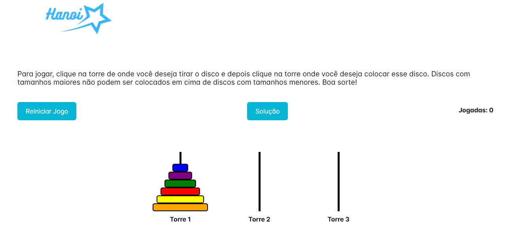

# Trabalho Especial de Estrutura de Dados

### Integrantes:

<a href="https://github.com/LeandroComD">Leandro Sales Santos</a>
12113476

<a href="https://github.com/LucasSangrecco">Lucas de Oliveira Rodrigues Abreu</a>
12113476

<a href="https://github.com/PatrickDSiqueira">Patrick Dias Siqueira</a>
12114788

<a href="https://github.com/TalisonMoura">Talison de Jesus Moura</a>
12114853

## Projeto: Torre de Hanoi - Aplicação de Estruturas de Dados

Este é o repositório do projeto "Torre de Hanoi", desenvolvido como parte do trabalho especial da disciplina de Estrutura de Dados. A seguir, você encontrará informações importantes sobre o projeto.

### Descrição do Projeto:

O objetivo deste projeto é aplicar os conceitos aprendidos em Estrutura de Dados para desenvolver uma implementação eficiente do famoso problema da Torre de Hanoi. A Torre de Hanoi é um quebra-cabeça matemático que envolve três pinos e um número qualquer de discos de tamanhos diferentes. O quebra-cabeça inicia com os discos em ordem crescente de tamanho em um dos pinos e o objetivo é mover todos os discos para outro pino, respeitando as seguintes regras:

1. Apenas um disco pode ser movido por vez.
2. Um disco só pode ser movido para o topo de outro pino se for menor do que o disco que já está lá.

### Imagem do Projeto:

### Contato:

Se você tiver dúvidas ou sugestões sinta-se a vontade de nos contatar.

Agradecemos pela sua colaboração!